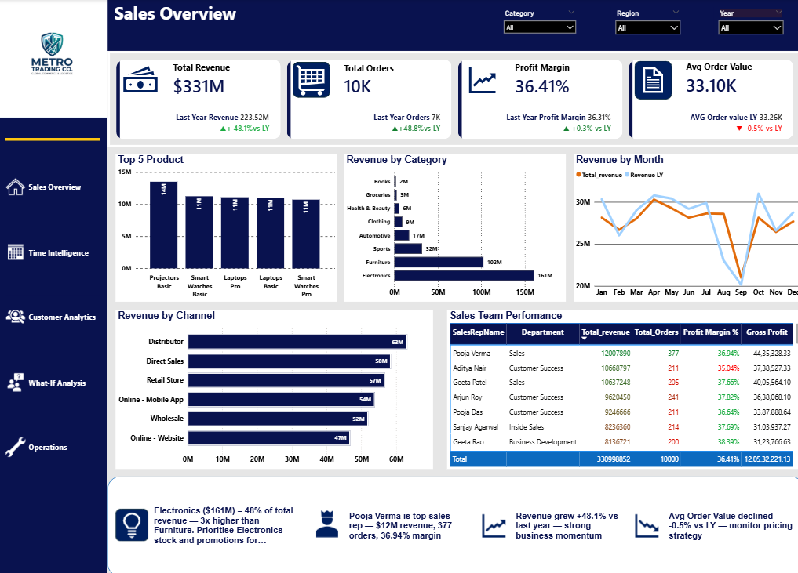
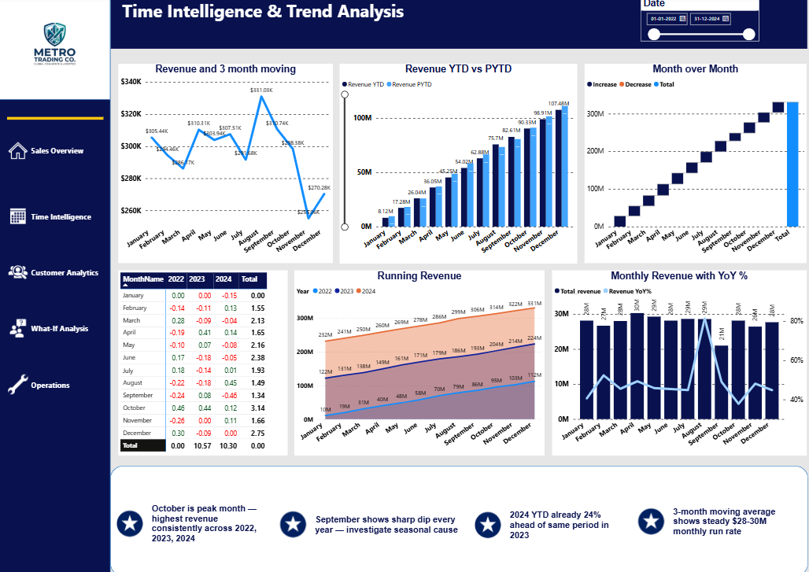
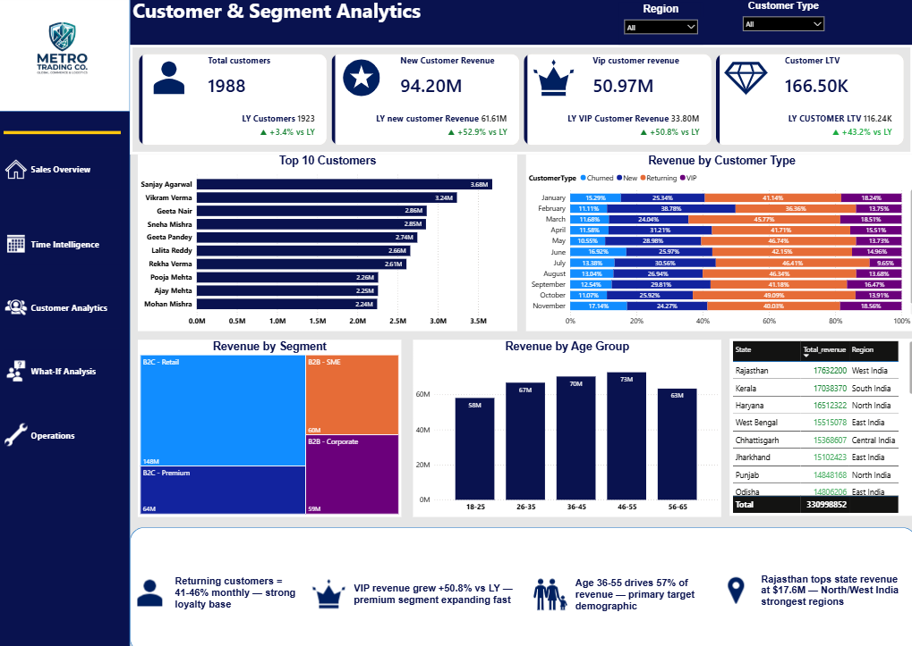
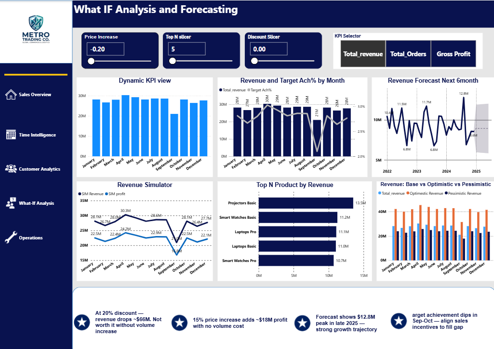
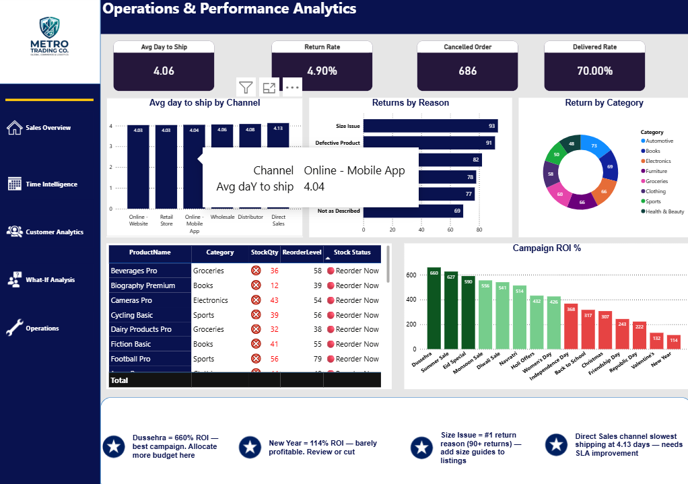

# 📊 Metro Trading Co. — Power BI Sales Intelligence Dashboard

<div align="center">


**A comprehensive 5-page business intelligence dashboard built in Power BI covering
sales performance, time intelligence, customer analytics, what-if forecasting,
and operational insights for Metro Trading Co. — a fictional US-based global commerce company.**

[🔗 View Live Dashboard](https://app.powerbi.com/links/oi2L2_SfAP?ctid=9f346197-2b2f-483c-a64d-bbb9b32891c3&pbi_source=linkShare) • [💼 LinkedIn](https://www.linkedin.com/in/muhammedriyan414a91214) • [📧 Contact](mailto:muhammedriyan8593@gmail.com)

</div>

---

## 🔗 Live Dashboard
**[👉 Click here to view the interactive report](https://app.powerbi.com/links/oi2L2_SfAP?ctid=9f346197-2b2f-483c-a64d-bbb9b32891c3&pbi_source=linkShare)**

> Open in any browser — no Power BI account required to view.

---

## 📸 Dashboard Pages

### Page 1 — Sales Overview


### Page 2 — Time Intelligence & Trend Analysis


### Page 3 — Customer & Segment Analytics


### Page 4 — What-IF Analysis and Forecasting


### Page 5 — Operations & Performance Analytics


---

## 📋 Project Overview

| Detail | Info |
|--------|------|
| **Tool** | Microsoft Power BI Desktop |
| **Data Source** | Excel (8 tables, custom generated) |
| **Records** | 10,000 orders, 2,000 customers, 192 products |
| **Time Period** | 2022 – 2024 (3 years) |
| **Pages** | 5 report pages + 1 tooltip page |
| **DAX Measures** | 25+ custom measures |
| **Built by** | Muhammad Riyan |

---

## 📄 Pages & Key Insights Found

### Page 1 — Sales Overview
**Visuals:** 4 KPI cards with icons + YoY trend arrows, Top 5 Products, Revenue by Category, Revenue by Channel, Revenue by Month (vs LY), Sales Team Performance table

**Key Insights:**
- 💡 Electronics ($161M) = 48% of total revenue — 3x higher than Furniture ($102M)
- 🏆 Pooja Verma is top sales rep — $12M revenue, 377 orders, 36.94% margin
- 📈 Revenue grew +48.1% vs last year — strong business momentum
- ⚠️ Avg Order Value declined -0.5% vs LY — monitor pricing strategy

---

### Page 2 — Time Intelligence & Trend Analysis
**Visuals:** 3-Month Moving Average, YTD vs PYTD bar chart, MoM Waterfall, MoM Heatmap Matrix, Running Revenue (3 years), Monthly Revenue with YoY%

**Key Insights:**
- 📅 October is peak month — highest revenue consistently across 2022, 2023, 2024
- 📉 September shows sharp dip every year — investigate seasonal cause
- 📈 2024 YTD already 24% ahead of same period in 2023
- ⚡ 3-month moving average shows steady $28–30M monthly run rate

---

### Page 3 — Customer & Segment Analytics
**Visuals:** 4 KPI cards (LTV, VIP, New Customer Revenue), Top 10 Customers, Revenue by Customer Type (100% stacked), Revenue by Segment Treemap, Revenue by Age Group, Revenue by State table

**Key Insights:**
- 👥 Returning customers = 41–46% monthly — strong loyalty base
- 👑 VIP revenue grew +50.8% vs LY — premium segment expanding fast
- 🎂 Age 36–55 drives 57% of revenue — primary target demographic
- 📍 Rajasthan tops state revenue at $17.6M — North/West India strongest regions

---

### Page 4 — What-IF Analysis and Forecasting
**Visuals:** 4 interactive parameters (Discount Slider, Price Increase, TopN, KPI Selector), Revenue Simulator, Target Achievement%, 6-Month Forecast, Scenario Comparison

**Key Insights:**
- 🎯 At 20% discount — revenue drops ~$66M. Not worth it without volume increase
- 📈 15% price increase adds ~$18M profit with no volume cost
- 🔮 Forecast shows $12.8M peak in late 2025 — strong growth trajectory
- ⚠️ Target achievement dips in Sep–Oct — align sales incentives to fill gap

---

### Page 5 — Operations & Performance Analytics
**Visuals:** 4 Operational KPIs, Shipping by Channel, Returns by Reason, Return by Category Donut, Stock Alert Table, Campaign ROI (color-coded)

**Key Insights:**
- 🏆 Dussehra = 660% ROI — best campaign. Allocate more budget here
- ❌ New Year = 114% ROI — barely profitable. Review or cut
- 📦 Size Issue = #1 return reason (93 returns) — add size guides to listings
- 🚚 Direct Sales channel slowest shipping at 4.13 days — needs SLA improvement

---

## 🛠️ Technical Skills Demonstrated

### Data Modeling
```
• Star schema with 5 active relationships
• Inactive relationship using USERELATIONSHIP (targets table)
• Date table marked as official date table
• DayOfWeekNumber calculated column for correct day sorting
• StockStatus calculated column for inventory alerts
```

### DAX Measures (25+)
```dax
-- Core KPIs
Total Revenue     = SUM(orders[TotalAmount])
Total Orders      = COUNTROWS(orders)
Gross Profit      = SUM(orders[GrossProfit])
Profit Margin %   = DIVIDE([Gross Profit], [Total Revenue], 0)
Unique Customers  = DISTINCTCOUNT(orders[CustomerID])

-- Time Intelligence
Revenue LY        = CALCULATE([Total Revenue], SAMEPERIODLASTYEAR(date_table[Date]))
Revenue YoY %     = DIVIDE([Total Revenue] - [Revenue LY], [Revenue LY], 0)
Revenue YTD       = TOTALYTD([Total Revenue], date_table[Date])
Revenue MTD       = TOTALMTD([Total Revenue], date_table[Date])
Revenue MoM %     = VAR P = CALCULATE([Total Revenue], PREVIOUSMONTH(date_table[Date]))
                    RETURN DIVIDE([Total Revenue] - P, P, 0)
3M Moving Avg     = AVERAGEX(DATESINPERIOD(date_table[Date],
                    LASTDATE(date_table[Date]), -3, MONTH), [Total Revenue])
Running Total     = CALCULATE([Total Revenue], FILTER(ALL(date_table),
                    date_table[Date] <= MAX(date_table[Date])))

-- Customer Analytics
Customer LTV      = DIVIDE([Total Revenue], [Unique Customers], 0)
New Cust Revenue  = CALCULATE([Total Revenue], Customers1[CustomerType]="New")
VIP Revenue       = CALCULATE([Total Revenue], Customers1[CustomerType]="VIP")

-- What-If Simulation
Sim Revenue       = [Total Revenue] * (1 - 'Discount Slider'[Discount Slider Value])
Sim Profit        = [Gross Profit]  * (1 + 'Price Increase'[Price Increase Value])
TopN Revenue      = IF([Product Revenue Rank] <= 'TopN Slider'[TopN Slider Value],
                    [Total Revenue], BLANK())

-- Operations
Avg Days to Ship  = AVERAGEX(orders, DATEDIFF(orders[OrderDate], orders[ShipDate], DAY))
Return Rate       = DIVIDE(COUNTROWS(returns), [Total Orders], 0)
Delivered Rate    = DIVIDE(CALCULATE([Total Orders],
                    orders[OrderStatus]="Delivered"), [Total Orders], 0)
```

### Power BI Features Used
| Feature | Used For |
|---------|----------|
| What-If Parameters (Numeric) | Discount Simulator, Price Increase, TopN Slicer |
| Field Parameters | Dynamic KPI metric switching (Revenue/Orders/Profit) |
| Page Tooltips | Hover detail popup on Revenue chart |
| Navigation Buttons | Left sidebar navigation across all 5 pages |
| Conditional Formatting | Table CF, Campaign ROI color, MoM heatmap |
| Analytics Pane Forecast | 6-month revenue forecast with confidence band |
| Sort by Column | MonthName → Month number, DayOfWeek → DayOfWeekNumber |
| Calculated Columns | StockStatus alert, DayOfWeekNumber |
| Key Insight Cards | Business insight text boxes on every page |
| Smart Icons | Power BI built-in icons on all KPI cards |

---

## 💡 Top 10 Business Insights from the Data

| # | Insight | Page |
|---|---------|------|
| 1 | Electronics drives 48% of total revenue — 3x more than any other category | Sales Overview |
| 2 | Revenue grew +48.1% YoY — strongest growth in company history | Sales Overview |
| 3 | October is consistently the peak revenue month across all 3 years | Time Intelligence |
| 4 | September shows a sharp dip every year — seasonal pattern needs investigation | Time Intelligence |
| 5 | VIP customer revenue grew +50.8% vs last year — premium segment is booming | Customer Analytics |
| 6 | Age 36-55 drives 57% of revenue — core target demographic | Customer Analytics |
| 7 | A 20% discount drops revenue by ~$66M — needs volume justification | What-If Analysis |
| 8 | Dussehra campaign delivers 660% ROI — highest of all 15 campaigns | Operations |
| 9 | Size Issue is the #1 return reason (93 returns) — product listings need size guides | Operations |
| 10 | Direct Sales has the slowest shipping at 4.13 days — SLA improvement needed | Operations |

---

## 📁 Repository Structure

```
MetroTrading-PowerBI-Dashboard/
├── MetroTrading_Dashboard.pbix        ← Power BI report (open in Desktop)
├── PowerBI_MegaDataset.xlsx           ← Source data (8 tables, 10K+ rows)
├── README.md                          ← This file
└── screenshots/
    ├── page1_sales_overview.png
    ├── page2_time_intelligence.png
    ├── page3_customer_analytics.png
    ├── page4_whatif_forecasting.png
    └── page5_operations.png
```

---

## 🚀 How to Run Locally

1. Download `MetroTrading_Dashboard.pbix` and `PowerBI_MegaDataset.xlsx`
2. Open `.pbix` in **Power BI Desktop** (free from microsoft.com/power-bi)
3. If data doesn't load: Transform Data → Data Source Settings → update file path
4. All 5 pages and interactive features will work immediately

**Or view online (no install needed):**
[👉 https://app.powerbi.com/links/oi2L2_SfAP](https://app.powerbi.com/groups/me/reports/66972394-a9af-4dcc-af27-b38637021164?ctid=9f346197-2b2f-483c-a64d-bbb9b32891c3&pbi_source=linkShare)

---

## 👤 About the Author

**Muhammad Riyan**
Data Analyst | Power BI | SQL | Excel

- 🔗 LinkedIn: [linkedin.com/in/muhammedriyan414a91214](https://www.linkedin.com/in/muhammedriyan414a91214)
- 💻 GitHub: [github.com/muhammedriyan-k](https://github.com/muhammedriyan-k)
- 📧 Email: muhammedriyan8593@gmail.com

---

> *Data is fictional and generated for portfolio demonstration purposes only.*
> *Built as part of a structured Power BI learning program covering beginner to advanced level.*
